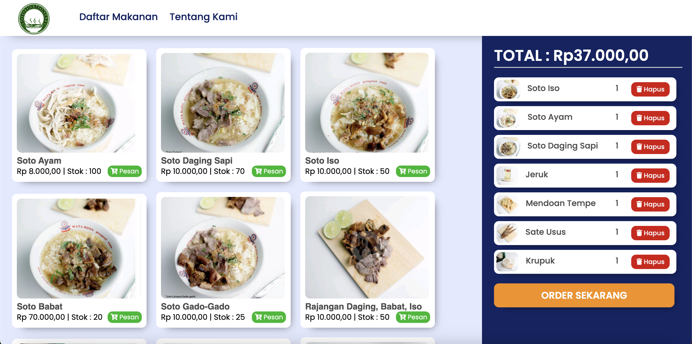

# Warteg Bemo

Soto Ijo Monjali berdiri sejak 17 Mei 2009 dan kini memiliki 5 cabang
yang tersebar di wilayah Daerah Istimewa Yogyakarta.
Kami merupakan sebuah warung makan yang beraneka soto dengan khas
rempah-rempah kaldu yang sangat lezat dan tradisonal. Tunggu apa
lagi? Jangan lewatkan! Temukan tempat Soto Ijo Monjali terdekat
sekarang. Pastikan cek lokasinya di Google Maps untuk panduan
tepat.

\*Note: aplikasi ini dibuat dalam rangka pembelajaran dan Tugas

Demo Aplikasi: [Soto Ijo Monjali]()

### Preview 1

### Preview 2

